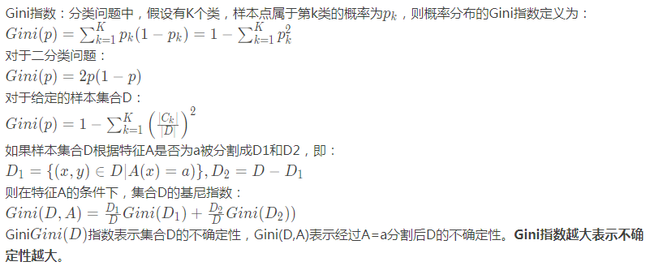

1. 

2. 
分类回归树(CART,Classification And Regression Tree)属于一种决策树
CART分析步骤
1、从根节点t=1开始，从所有可能候选S集合中搜索使不纯性降低最大的划分S*，然后，使用划分S*将节点1（t=1）划分成两个节点t=2和t=3；
2、在t=2和t=3上分别重复划分搜索过程。
基尼不纯度指标
在CART算法中, 基尼不纯度表示一个随机选中的样本在子集中被分错的可能性。基尼不纯度为这个样本被选中的概率乘以它被分错的概率。当一个节点中所有样本都是一个类时，基尼不纯度为零

3.
决策树为什么要剪枝？
原因是避免决策树过拟合(Overfitting)样本。算法生成的决策树非常详细并且庞大，每个属性都被详细地加以考虑，决策树的树叶节点所覆盖的训练样本都是“纯”的。因此用这个决策树来对训练样本进行分类的话，你会发现对于训练样本而言，这个树表现完好，误差率极低且能够正确得对训练样本集中的样本进行分类。训练样本中的错误数据也会被决策树学习，成为决策树的部分，但是对于测试数据的表现就没有想象的那么好，或者极差，这就是所谓的过拟合(Overfitting)问题。Quinlan教授试验，在数据集中，过拟合的决策树的错误率比经过简化的决策树的错误率要高。
 
