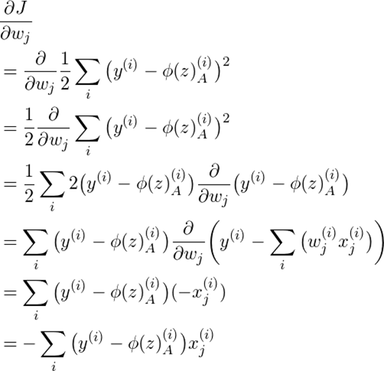

1. 了解什么是Machine learning

类似于泛函，通过输入数据找到一个合适的函数。


2. 学习中心极限定理，学习正态分布，学习最大似然估计

2.1 推导回归Loss function

E=sum((y-yhat).^2). yhat=WX+b. Find the suitable X to make E smallest.


2.2 学习损失函数与凸函数之间的关系

凸函数的切线方向是损失函数的迭代方向。（？）

2.3 了解全局最优和局部最优

函数有多个凹谷时，普通迭代可能会陷入局部最优，一般和初始值的选取有关。

3. 学习导数，泰勒展开

3.1 推导梯度下降公式



3.2 写出梯度下降的代码

  ```python
  import numpy as np
  x = np.array([1,2,3])
  y = np.array([2,4,6])
  
  epoches = 10
  lr = 0.1
  w = 0
  cost=[]
  
  for epoch in range(epoches):
      yhat = x*w
      loss = np.average((yhat-y)**2)
      cost.append(loss)
      dw = -2*(y-yhat)@ x.T/(x.shape[0])
      w=w-lr*dw
      print(w)
  ```

4. 学习L2-Norm，L1-Norm，L0-Norm

L0范数是指向量中非0的元素的个数。如果我们用L0范数来规则化一个参数矩阵W的话，就是希望W的大部分元素都是0。换句话说，让参数W是稀疏的。

L1范数是指向量中各个元素绝对值之和。L1适用于特征选择，可解释性。

L2范数是指向量各元素的平方和然后求平方根。我们让L2范数的规则项||W||2最小，可以使得W的每个元素都很小，都接近于0,平滑，平滑的function对异常值不敏感，但不能平滑成一条水平线

4.1 推导正则化公式

TBD

4.2 说明为什么用L1-Norm代替L0-Norm

L1范数是L0范数的最优凸近似。任何的规则化算子，如果他在Wi=0的地方不可微，并且可以分解为一个“求和”的形式，那么这个规则化算子就可以实现稀疏。W的L1范数是绝对值，|w|在w=0处是不可微。 虽然L0可以实现稀疏，但是实际中会使用L1取代L0。因为L0范数很难优化求解，L1范数是L0范数的最优凸近似，它比L0范数要容易优化求解。

4.3 学习为什么只对w/Θ做限制，不对b做限制

因为b不影响函数的平滑程度，只影响整体平移
